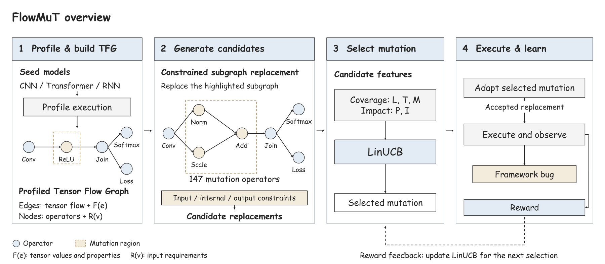

<p align="center">
  
</p>

# FlowMuT

This is the code repository for the paper **Grounding Deep Learning Framework Testing in Data Flow**. FlowMuT builds a Tensor Flow Graph from a seed model, generates legal model mutations, and tests deep learning frameworks for bugs. It supports PyTorch (eager and compiled) and MindSpore (PyNative and Graph).



The repository includes 14 seed models, 147 mutation operators, the testing engine, and [bug reports with reproducers](bugs/). The implementation is in `flowmut/`; launch scripts are in `scripts/`.

## Setup

Use separate Python environments for PyTorch and MindSpore, with `numpy` installed. The paper's environments use PyTorch 2.12.1 on Python 3.13 and MindSpore 2.7.1 on Python 3.9. Install FlowMuT in each environment from this directory:

```bash
python -m pip install -e .
```

## Smoke test

Run a short end-to-end check across the four execution modes:

```bash
python scripts/run_smoke.py --rounds 3 --ms-python /path/to/mindspore/python
```

The MindSpore interpreter can also be set with `FLOWMUT_MS_PYTHON` or discovered automatically. Without one, the smoke script skips MindSpore. Results are written to `runs/smoke/`.

## Full campaigns

List seed models, then choose a framework, mode, models, and rounds:

```bash
python scripts/run_experiment.py --list-seeds

python scripts/run_experiment.py --framework pytorch --mode eager \
  --seeds convnext_v2_tiny efficientnetv2_s --rounds 250

python scripts/run_experiment.py --framework mindspore --mode graph \
  --seeds all --rounds 250 --ms-python /path/to/mindspore/python
```

Use `--framework all --seeds all` to run every model in all four modes. Omit `--mode` to run both modes of the selected framework. Preview the plan with `--dry-run`. Each campaign runs in a separate process; reports, logs, and a run manifest are saved under `runs/experiments/<timestamp>/`.

## License

[MIT](LICENSE) © 2026 Anonymous Authors.
